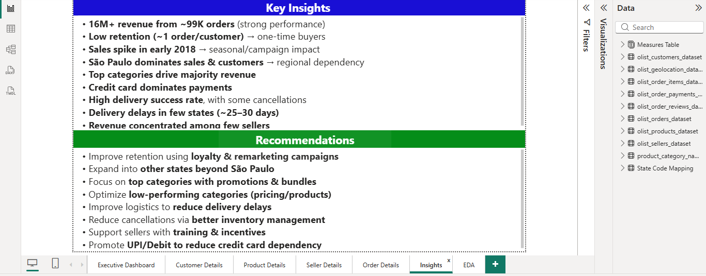
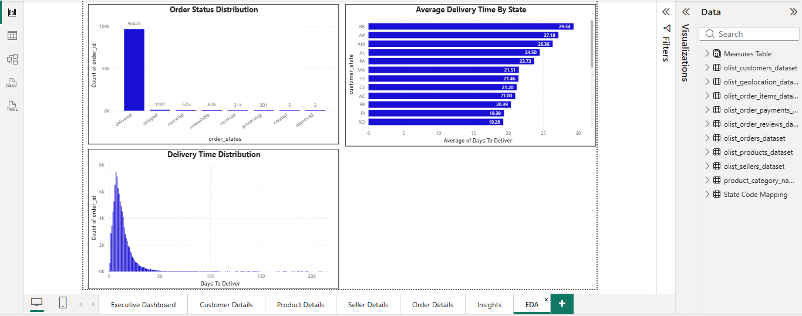

# 🛒 Brazilian E-Commerce Analysis | Power BI Project

## 📌 Project Overview

This project is an end-to-end Business Intelligence solution built using Power BI on the Brazilian E-Commerce (Olist) dataset.

The dashboard analyzes customer behavior, sales trends, product performance, seller contribution, delivery efficiency, and payment patterns to generate meaningful business insights and recommendations.

The project demonstrates skills in:
- Data Cleaning
- Data Transformation
- Data Modeling
- DAX Calculations
- Dashboard Design
- Business Intelligence

---

# 🎯 Business Objective

The objective of this project is to:
- Analyze overall sales performance
- Identify top-performing products and categories
- Understand customer purchasing behavior
- Track seller performance
- Analyze delivery efficiency
- Generate actionable business insights

---

# 🧰 Tools & Technologies Used

- Power BI
- Power Query
- DAX
- Data Modeling
- Excel / CSV Files

---

# 📂 Dataset Information

Dataset Used:
Brazilian E-Commerce Public Dataset (Olist)

### Dataset Includes
- Customers
- Orders
- Products
- Sellers
- Payments
- Reviews
- Geolocation Data

### Dataset Size
- ~99K Orders
- ~99K Customers
- ~33K Products
- ~3K Sellers

---

# 🧹 Data Cleaning & Transformation

Performed the following preprocessing steps using Power Query:
- Removed null values
- Fixed data types
- Removed duplicates
- Renamed columns
- Created calculated columns
- Cleaned inconsistent values

---

# 🧩 Data Modeling

Built relationships between multiple tables using a structured data model.

### Tables Used
- Customers
- Orders
- Order Items
- Products
- Sellers
- Payments
- Reviews
- Geolocation

---

# 📈 DAX Measures Used

```DAX
Total Revenue = SUM(payment_value)

Total Orders = DISTINCTCOUNT(order_id)

Total Customers = DISTINCTCOUNT(customer_unique_id)

Average Review = AVERAGE(review_score)

Average Delivery Days =
AVERAGE(Days To Deliver)
```

---

# 📊 Dashboard Pages

## 1️⃣ Executive Dashboard
Provides a high-level overview of:
- Revenue
- Orders
- Customers
- Product Performance
- State-wise Sales


---

## 2️⃣ Customer Details Dashboard
Analyzes:
- Customer distribution
- Customer order trends
- Top states by customers
- Order status analysis


---

## 3️⃣ Product Details Dashboard
Analyzes:
- Top product categories
- Revenue by category
- Product order analysis
- Product performance


---

## 4️⃣ Seller Details Dashboard
Analyzes:
- Top sellers by revenue
- Seller contribution
- State-wise seller sales
- Average orders per seller


---

## 5️⃣ Order Details Dashboard
Analyzes:
- Payment methods
- Monthly order trends
- Delivery performance
- Orders by state


---

## 6️⃣ Insights & Recommendations

### Key Insights
- Generated 16M+ revenue from ~99K orders
- São Paulo dominates sales and customers
- Credit card is the dominant payment method
- Most orders are successfully delivered
- Delivery delays observed in few states

### Recommendations
- Improve customer retention strategies
- Reduce delivery delays
- Expand business into more states
- Optimize low-performing categories



---

## 7️⃣ Exploratory Data Analysis (EDA)

Performed additional analysis on:
- Order status distribution
- Delivery time distribution
- Delivery delays by state



---

# 📈 Key KPIs

| KPI | Value |
|-----|-------|
| Total Revenue | 16.01M |
| Total Orders | 99K |
| Total Customers | 99K |
| Total Products | 33K |
| Average Review Score | 4.09 |
| Average Delivery Time | 12.5 Days |

---

# 💡 Skills Demonstrated

✅ Data Cleaning  
✅ Data Transformation  
✅ Data Modeling  
✅ DAX Calculations  
✅ Dashboard Design  
✅ Business Intelligence  
✅ Data Visualization  
✅ Insight Generation  

---

# 📁 Project Structure

```


Brazilian-E-Commerce-Analysis/
│
├── Brazilian E-Commerce Dataset/
├── Images/
├── Brazilian E-commerce.pbix
├── README.md
├── LICENSE
└── Capstone Project Report.docx

```

---

# 🚀 Project Outcome

Successfully developed a professional Power BI dashboard that transforms raw e-commerce data into meaningful business insights for better decision-making.

---

## 📌 Conclusion

This project demonstrates how data analytics and business intelligence can be used to:

* Analyze large-scale e-commerce data
* Track sales, customer, and seller performance
* Improve operational and delivery efficiency
* Generate business-driven insights for decision-making
* Build interactive dashboards using Power BI

---

## 👨‍💻 Author

**Siva Sai Gopal Mandru**  
Data Analyst (Fresher)

---

## 🔗 GitHub Repository

```


https://github.com/sivasaigopalm3777/Brazilian-E-Commerce-Analysis

```

---

## 💬 Feedback

Feel free to share your feedback and suggestions!
